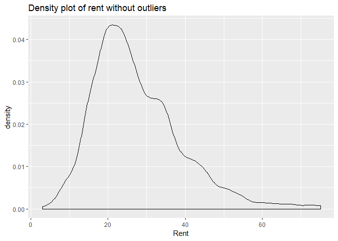
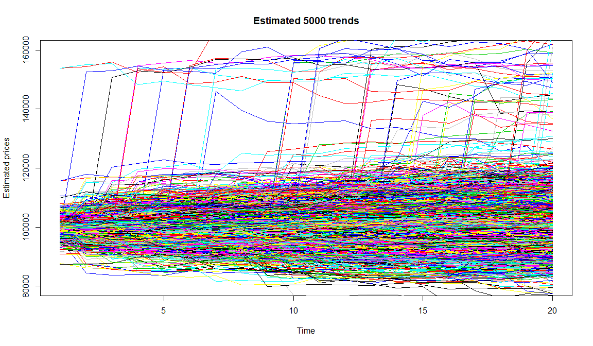

Untitled
================
Jason Su
August 9, 2018

Probability practice
====================

Part A
------

From the question, we know that *P*<sub>*R**C*</sub> = 0.3; *P*<sub>*Y*|*R**C*</sub> = 0.5; *P*<sub>*Y*</sub> = 0.65. Therefore, we could set up equation as followed:
*P*<sub>*Y*</sub> = *P*<sub>*Y*, *R**C*</sub> + *P*<sub>*Y*, *T**C*</sub>
⇒*P*<sub>*Y*</sub> = *P*(*Y*|*R**C*)\**P*<sub>*R**C*</sub> + *P*(*Y*|*P**C*)\**P*<sub>*T**C*</sub>
⇒0.65 = 0.5 \* 0.3 + *P*(*Y*|*P**C*)\*0.7
 We got,
$$P(Y|PC) = \\frac{0.65 - 0.5\*0.3}{0.7}$$
$$\\Rightarrow P(Y|PC) = \\frac{5}{7}$$
 Around 71.43% of people who are truthful clickers answered yes.

Part B
------

We want to get the probability of having the disease based on getting positive result for the test. Let's denote it as *P*(*T*|*P*).

According to the Bayes' theorem,
$$P(T|P) = \\frac{P\_{T,P}}{P\_{p}}$$
$$\\Rightarrow P(T|P) = \\frac{P(P|T)\*P\_{T}}{P(P|T)\*P\_{T} + P(P|F)\*P\_{F}}$$
 According to the question, we got *P*<sub>*T*</sub> = 0.000025; *P*(*P*|*T*)=0.993; *P*(*P*|*F*)=1 − 0.9999 = 0.0001

$$\\Rightarrow P(T|P) = \\frac{0.993\*0.000025}{0.993\*0.000025 + 0.0001\*0.999975}$$

⇒*P*(*T*|*P*)≈0.1989
 The probability of having the disease is about 19.89%.

Problems in implementing a universal testing policy:

1.  The probability of having the disease when getting positive result is actually not high. The result might cause unnecessary panic;
2.  All assumed probabilities need to be very accurate which might be hard to achieve in reality.

Exploratory analysis: green buildings
=====================================

``` r
library(ggplot2)
dat=read.csv("greenbuildings.csv")
```

1. Is it reasonable to remoeve low occupied outliers?
-----------------------------------------------------

### *"I decided to remove these buildings from consideration, on the theory that these buildings might have something weird going on with them, and could potentially distort the analysis."*

``` r
par(mfrow=c(1,2))
greenbuilding = dat[,-c(12,13)]
greenbuilding$green_rating = factor(greenbuilding$green_rating)
greenbuilding$cluster = factor(greenbuilding$cluster)
ggplot(greenbuilding, aes(x=leasing_rate, y=Rent)) + geom_point()+ggtitle("Rent vs. occupancy rate with outliers")
```


``` r
mask = which(greenbuilding$leasing_rate > 10)
greenbuilding = greenbuilding[mask,]
ggplot(greenbuilding, aes(x=leasing_rate, y=Rent)) + geom_point()+ggtitle("Rent vs. occupancy rate without outliers")
```


### From the scatterplot we can see that there is a specific pattern when x is small. Therefore, it is correct to remove the outliers.

2. Should we use median or mean?
--------------------------------

### *"I used the median rather than the mean, because there were still some outliers in the data, and the median is a lot more robust to outliers."*

``` r
ggplot(greenbuilding,aes(x=Rent))+geom_density()+ggtitle("Density plot of rent with outliers")
```


``` r
mask2 = which(greenbuilding$Rent > 75)
paste("The number of outliers is",length(mask2))
```

    ## [1] "The number of outliers is 112"

``` r
outliers = greenbuilding[mask2,]
remain = greenbuilding[-mask2,]
```

### We decided to use median or mean mainly based on the distribution and size of the dataset. From the first plot, we could see that the number of outliers is not small and the density plot is right-skewed. Therefore, it might be better to use median to measure the central tendency of the dataset. However, without the outliers the distribution of the dataset is quiet normally distributed which might be caused by its large size. So let's try to dig into these outliers to check whether it is reasonable to remove them. We could also see that if we are able to remove them, the distribution is much more normally ditributed.

``` r
library(gridExtra)

paste("The mean of rent of outliers is ",mean(outliers$Rent),", while the mean of rent of all buildings is ",mean(greenbuilding$Rent))
```

    ## [1] "The mean of rent of outliers is  103.209285714286 , while the mean of rent of all buildings is  28.5858458132569"

``` r
paste("The mean of stories of outliers is ",mean(outliers$stories),", while the mean of stories of all buildings is ",mean(greenbuilding$stories))
```

    ## [1] "The mean of stories of outliers is  29.2946428571429 , while the mean of stories of all buildings is  13.8299257715848"

``` r
paste("The number of green buildings among outliers is ",sum(outliers$green_rating=="1"),", while the number of outliers is ",dim(outliers)[1],". The fraction is ",sum(outliers$green_rating=="1")/dim(outliers)[1])
```

    ## [1] "The number of green buildings among outliers is  7 , while the number of outliers is  112 . The fraction is  0.0625"

``` r
rent_set = data.frame(ca=c("Outliers","All"),
                      rent=c(mean(outliers$Rent),mean(greenbuilding$Rent)))
p1=ggplot(data=rent_set,aes(x=ca,y=rent,fill=ca))+geom_bar(stat="identity")+ggtitle("Comparison of Rent")

story_set = data.frame(ca=c("Outliers","All"),
                      story=c(mean(outliers$stories),mean(greenbuilding$stories)))
p2=ggplot(data=story_set,aes(x=ca,y=story,fill=ca))+geom_bar(stat="identity")+ggtitle("Comparison of Story")

number_set = data.frame(ca=c("Green","Non Green"),
                      number=c(sum(outliers$green_rating=="1"),dim(outliers)[1]-sum(outliers$green_rating=="1")))
p3=ggplot(number_set,aes(x="",y=number,fill=ca))+geom_bar(width = 1, stat = "identity")+coord_polar("y", start=0)+ggtitle("GB Among Outliers")

grid.arrange(p1,p2,p3, ncol=3)
```


### From the graphs, we can see that first, most of these outliers have significantly higher rent than the average level. And then most of them have specifically high stories level which might be the reason of extremely high rent. Considering we are estimating for a 15-story building. These outliers might be less valuable for analysis. In addition, among these outliers, there exist few green buildings, which means we are not able to compare green and non-green building among these outleirs.In conclusion, we might not miss insight even if we remove these outliers.

``` r
ggplot(remain,aes(x=Rent))+geom_density()+ggtitle("Density plot of rent without outliers")
```

 \#\#\# After removing these outliers, the distribution of rent approximates to normal distribution and the data size is still large enough. In this case, we are able to use "mean" to estimate central tendency in later analysis.

3. Should we just compare the mean rent of buildings from all areas?
--------------------------------------------------------------------

### *"The median market rent in the non-green buildings was $25 per square foot per year, while the median market rent in the green buildings was $27.60 per square foot per year"*

``` r
library(dplyr)

mean_rent_green = remain %>% group_by(cluster) %>% 
  summarise(diff=mean(Rent[green_rating==1])-mean(Rent[green_rating==0]))

ggplot(data=mean_rent_green, aes(x=cluster, y=diff)) +
  geom_bar(stat="identity",position=position_dodge())+ggtitle("Difference of rent between green and non-green within different clusters")
```


### From the result we can see that the difference of median price of green and non-green buildings vary a lot. Therefore, we need to find out which cluster this building belongs to and estimate the price again based on its cluster.

4. Future Estimation
--------------------

### *"The median market rent in the non-green buildings was $25 per square foot per year, while the median market rent in the green buildings was $27.60 per square foot per year: about $2.60 more per square foot."*

### Instead of revenue, we might be more interested in the future profit, which means we should also consider about the cost.

``` r
remain["profit"]=remain["Rent"]-remain["Gas_Costs"]-remain["Electricity_Costs"]
remain=remain[,-c(19,20)]

profit_set = remain %>% group_by(green_rating) %>% summarise(mean=mean(profit))
ggplot(data=profit_set,aes(x=green_rating,y=mean,fill=green_rating))+geom_bar(stat="identity")+ggtitle("Comparison of mean rent")
```


Bootstrapping
=============

``` r
library(mosaic)
library(quantmod)
library(foreach)

#Import the needed stocks data from 2007-01-01
stocks_list = c("SPY","TLT","LQD","EEM","VNQ")
getSymbols(stocks_list,from="2007-01-01")
```

    ## [1] "SPY" "TLT" "LQD" "EEM" "VNQ"

``` r
SPYa = adjustOHLC(SPY)
TLTa = adjustOHLC(TLT)
LQDa = adjustOHLC(LQD)
EEMa = adjustOHLC(EEM)
VNQa = adjustOHLC(VNQ)
```

Estimate the risk/return properties of the five major asset classes
-------------------------------------------------------------------

``` r
set.seed("666666")

all_returns = ClCl(SPYa)

all_returns = as.matrix(na.omit(all_returns))

initial_wealth = 100000
simSPY = foreach(i=1:5000, .combine='rbind') %do% {
    total_wealth = initial_wealth
    holdings = total_wealth
    n_days = 20
    wealthtracker = rep(0, n_days)
    for(today in 1:n_days) {
        return.today = resample(all_returns,1, orig.ids=FALSE)
        holdings = holdings + holdings*return.today
        total_wealth = sum(holdings)
        wealthtracker[today] = total_wealth
    }
    wealthtracker
}

# Calculate 5% value at risk
SPYVar=quantile(simSPY[,n_days], 0.05) - initial_wealth
SPYprofit = quantile(simSPY[,n_days], 0.90) - initial_wealth
```

``` r
t <- matrix(c(SPYVar,SPYprofit,TLTVar,TLTprofit,LQDVar,LQDprofit,EEMVar,EEMprofit,VNQVar,VNQprofit),ncol=2,byrow=TRUE)
colnames(t) <- c("5% Value at Risk","The top 10% potential profit")
rownames(t) <- c("SPY","TLT","LQD","EEM","VNQ")
t <- as.table(t)
t
```

    ##     5% Value at Risk The top 10% potential profit
    ## SPY        -8365.821                     7603.965
    ## TLT        -5997.583                     5913.915
    ## LQD        -3090.944                     2951.878
    ## EEM       -13237.404                    11921.311
    ## VNQ       -13954.554                    12189.729

``` r
par(mfrow=c(3,2))
hist(simSPY[,n_days]- initial_wealth, breaks=30,main="Estimated profit/loss at the end day for SPY")
hist(simTLT[,n_days]- initial_wealth, breaks=30,main="Estimated profit/loss at the end day for TLT")
hist(simLQD[,n_days]- initial_wealth, breaks=30,main="Estimated profit/loss at the end day for LQD")
hist(simEEM[,n_days]- initial_wealth, breaks=30,main="Estimated profit/loss at the end day for EEM")
hist(simVNQ[,n_days]- initial_wealth, breaks=30,main="Estimated profit/loss at the end day for VNQ")

par(mfrow=c(3,3))
```


``` r
x=1:n_days
plot(x,simSPY[1,],xlab="Time",ylab="Estimated prices",type = "l",ylim=c(80000,160000),main="Estimated 5000 trends for SPY")
for(i in 2:5000){
  lines(x,simSPY[i,],col=i)
}

plot(x,simTLT[1,],xlab="Time",ylab="Estimated prices",type = "l",ylim=c(80000,160000),main="Estimated 5000 trends for TLT")
for(i in 2:5000){
  lines(x,simTLT[i,],col=i)
}

plot(x,simLQD[1,],xlab="Time",ylab="Estimated prices",type = "l",ylim=c(80000,160000),main="Estimated 5000 trends for LQD")
for(i in 2:5000){
  lines(x,simLQD[i,],col=i)
}
plot(x,simEEM[1,],xlab="Time",ylab="Estimated prices",type = "l",ylim=c(80000,160000),main="Estimated 5000 trends for EEM")
for(i in 2:5000){
  lines(x,simEEM[i,],col=i)
}
plot(x,simVNQ[1,],xlab="Time",ylab="Estimated prices",type = "l",ylim=c(80000,160000),main="Estimated 5000 trends for VNQ")
for(i in 2:5000){
  lines(x,simVNQ[i,],col=i)
}
```


The even split
--------------

``` r
set.seed("666666")

all_returns = cbind(    ClCl(SPYa),
                                ClCl(TLTa),
                                ClCl(LQDa),
                                ClCl(EEMa),
                                ClCl(VNQa))

all_returns = as.matrix(na.omit(all_returns))

initial_wealth = 100000
sim1 = foreach(i=1:5000, .combine='rbind') %do% {
    total_wealth = initial_wealth
    weights = c(0.2, 0.2, 0.2, 0.2, 0.2)
    holdings = weights * total_wealth
    n_days = 20
    wealthtracker = rep(0, n_days)
    for(today in 1:n_days) {
        return.today = resample(all_returns, 1, orig.ids=FALSE)
        holdings = holdings + holdings*return.today
        total_wealth = sum(holdings)
        wealthtracker[today] = total_wealth
    }
    wealthtracker
}

par(mfrow=c(1,2))

hist(sim1[,n_days], 30, main="Estimated prices at the end day")

#profit/loss
hist(sim1[,n_days]- initial_wealth, breaks=30,main="Estimated profit/loss at the end day")
```


``` r
# Calculate 5% value at risk
Var=quantile(sim1[,n_days], 0.05) - initial_wealth
paste("The 5% value at risk is ",Var)
```

    ## [1] "The 5% value at risk is  -6100.79484318168"

``` r
par(mfrow=c(1,1))

x=1:n_days
plot(x,sim1[1,],xlab="Time",ylab="Estimated prices",type = "l",ylim=c(80000,160000),main="Estimated 5000 trends")
for(i in 2:5000){
  lines(x,sim1[i,],col=i)
}
```


The safer choice
----------------

From the results, we can see that SPY,TLT and LQD, especially LQD, are relatively safer choices. Therefore, we allocate 0.2,0.3,0.5 to SPY,TLT and LQD

``` r
set.seed("666666")

all_returns = cbind(    ClCl(SPYa),
                                ClCl(TLTa),
                                ClCl(LQDa))

all_returns = as.matrix(na.omit(all_returns))

initial_wealth = 100000
sim1 = foreach(i=1:5000, .combine='rbind') %do% {
    total_wealth = initial_wealth
    weights = c(0.2, 0.3, 0.5)
    holdings = weights * total_wealth
    n_days = 20
    wealthtracker = rep(0, n_days)
    for(today in 1:n_days) {
        return.today = resample(all_returns, 1, orig.ids=FALSE)
        holdings = holdings + holdings*return.today
        total_wealth = sum(holdings)
        wealthtracker[today] = total_wealth
    }
    wealthtracker
}

par(mfrow=c(1,2))

hist(sim1[,n_days], 30, main="Estimated prices at the end day")

#profit/loss
hist(sim1[,n_days]- initial_wealth, breaks=30,main="Estimated profit/loss at the end day")
```


``` r
# Calculate 5% value at risk
Var=quantile(sim1[,n_days], 0.05) - initial_wealth
paste("The 5% value at risk is ",Var)
```

    ## [1] "The 5% value at risk is  -2840.49306046622"

``` r
par(mfrow=c(1,1))

x=1:n_days
plot(x,sim1[1,],xlab="Time",ylab="Estimated prices",type = "l",ylim=c(80000,160000),main="Estimated 5000 trends")
for(i in 2:5000){
  lines(x,sim1[i,],col=i)
}
```


The more aggressive choice
--------------------------

From the result, we can see that EEM and VNQ are more risky choices, but we still want to keep the SPY to control the risk within acceptable range. Therefore, we allocate 0.4,0.3,0.3 to SPY,EEM and VNQ.

``` r
set.seed("666666")

all_returns = cbind(    ClCl(SPYa),
                                ClCl(EEMa),
                                ClCl(VNQa))

all_returns = as.matrix(na.omit(all_returns))

initial_wealth = 100000
sim1 = foreach(i=1:5000, .combine='rbind') %do% {
    total_wealth = initial_wealth
    weights = c(0.4,0.3,0.3)
    holdings = weights * total_wealth
    n_days = 20
    wealthtracker = rep(0, n_days)
    for(today in 1:n_days) {
        return.today = resample(all_returns, 1, orig.ids=FALSE)
        holdings = holdings + holdings*return.today
        total_wealth = sum(holdings)
        wealthtracker[today] = total_wealth
    }
    wealthtracker
}

par(mfrow=c(1,2))

hist(sim1[,n_days], 30, main="Estimated prices at the end day")

#profit/loss
hist(sim1[,n_days]- initial_wealth, breaks=30,main="Estimated profit/loss at the end day")
```


``` r
# Calculate 5% value at risk
Var=quantile(sim1[,n_days], 0.05) - initial_wealth
paste("The 5% value at risk is ",Var)
```

    ## [1] "The 5% value at risk is  -10462.6606040255"

``` r
par(mfrow=c(1,1))

x=1:n_days
plot(x,sim1[1,],xlab="Time",ylab="Estimated prices",type = "l",ylim=c(80000,160000),main="Estimated 5000 trends")
for(i in 2:5000){
  lines(x,sim1[i,],col=i)
}
```


